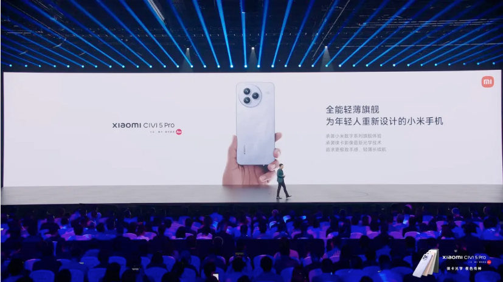
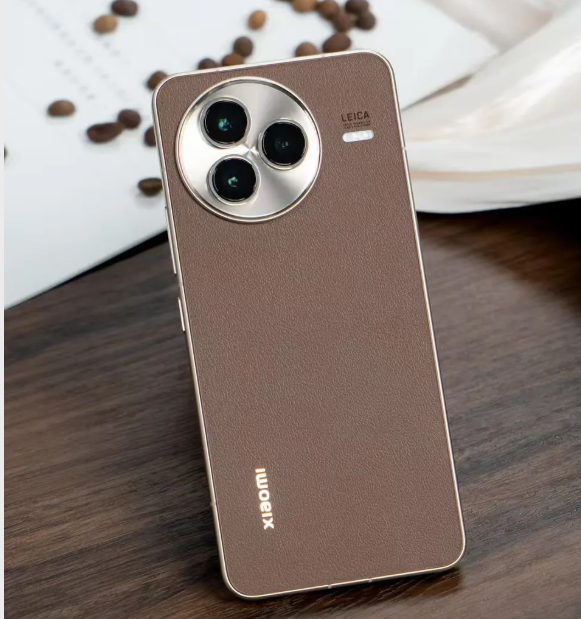

# Xiaomi Civi5 Pro: The Most Miserable Xiaomi Phone This Year?

# 📱Xiaomi Civi5 Pro: The Most Miserable Xiaomi Phone This Year?

Hey techies! Let's take a trip down memory lane to Xiaomi's 15th - anniversary strategic new product launch event in May. Remember the thrill when products like the Xuanjie O1, Xiaomi 15S Pro, and Xiaomi YU7 were unveiled? But hold on, some of you might have already forgotten about another device that made its debut at the same event - the Xiaomi Civi5 Pro. 🤔

<!--more-->

As the fifth - generation model of the Civi series, Lei Jun announced that the Civi5 Pro would be transformed into an all - around thin and light flagship. Sounds exciting, right? Well, reality hit a bit differently. After its release, the Civi5 Pro didn't exactly set the sales charts on fire. Instead, it quickly got overshadowed by competing products from other brands. So, what went wrong? Let's dive in! 🚀

## Poor Market Performance

According to data from the Weibo data blogger @RD Observation, in the "offline - focused phone" category, the Xiaomi Civi5 Pro has become a rather unfortunate benchmark. The OPPO Reno14 sold 7.4 times more units than the Civi5 Pro in just three days, while the Huawei nova14 achieved a sales volume 10.2 times higher. These numbers don't lie - the Civi5 Pro is struggling in the market. 😔

## Design: A Missed Opportunity?

One of the most - debated aspects of the Xiaomi Civi5 Pro on the internet is its design, especially the appearance. The small circular camera module in the upper left corner had already faced a lot of criticism in the previous Civi4 Pro and Redmi K80 series. But guess what? The Civi5 Pro decided to keep this controversial design. It's like they took a page out of OnePlus' book, but not in a good way. 📖

The back panel design of the Civi5 Pro is more streamlined compared to its predecessor, but it's still neither coordinated nor remarkable. It just doesn't have that "wow" factor. On the plus side, the build quality is actually quite good. The combination of metal and glass materials for the Deco, along with the metal frame, gives a better in - hand feel than the previous Civi model and the K80 series. And it's thin and light, with a thickness of 7.65mm and a weight of 181g, which is in line with the Civi series' signature. 👍

## Configuration: Underwhelming Upgrades

If the Civi5 Pro had some killer performance to make up for its so - so design, it might have stood a chance. But unfortunately, its 2025 upgrade is a bit lackluster. The phone still uses a 6.55 - inch 1.5K equal - depth four - curved screen. This was considered advanced last year when used in the Civi4 Pro, but in 2025, flat screens are the new trend. It's like showing up to a party in last year's outfit. 🎉

Thanks to the upgrade to the Snapdragon 8s Gen4 processor, the daily performance is smooth. There are fewer frame drops compared to its predecessor, and it can handle games like *Honor of Kings* without major issues. The 6000mAh battery provides decent battery life in real - world use. 🔋

In terms of imaging, while maintaining the Leica color tone, the Civi5 Pro upgrades its telephoto lens to the same one used in the Xiaomi 15. It also supports telephoto macro shooting, and the daily photo quality is more refined than that of the Redmi K80 Pro with similar hardware but without Leica tuning. However, that's about it. There aren't many other impressive highlights. In fact, it seems to have regressed in some aspects. It has a dual - hole front - facing camera setup, but in reality, it only has a single camera. And the previously competitive front - facing dual - flash feature is gone. 😭

## Fierce Competition from Rivals

When we look at competing products from other brands, both the OPPO Reno14 series and the vivo S30 series have taken the live photo experience to a whole new level. They offer features like converting 4K videos into live photos and creating a variety of atmospheric live photo styles. The Pro versions of these two series have unique selling points too. The OPPO Reno14 Pro is called the "Android live - streaming artifact", and the vivo S30 Pro features a "flagship small screen". 🌟

It's not that Xiaomi can't make phones for female users. The Xiaomi MIX Flip, last year's small foldable phone, proved that. But with a starting price of 2999 yuan and lacking distinct competitive features, the Civi5 Pro has a hard time standing out. Especially when OPPO and vivo have equipped even their standard - version phones with periscope telephoto lenses. And after the price reduction of the Xiaomi 15, the Civi5 Pro is in an even more awkward situation. Consumers might think it's more worthwhile to add a little more money to get the Xiaomi 15. And when you compare the details, the Civi5 Pro lacks many of the advanced features of Xiaomi's flagship phones, such as ultrasonic fingerprint sensors and top - tier waterproofing. 💦

## Conclusion: A Glimmer of Hope?

Currently, the Civi series gives the impression that after the original product manager Xin Xin moved to the Redmi team, it has been somewhat neglected. The priority of launching new features and configurations for Civi products is lower than that for Redmi. The Civi5 Pro is starting to feel like the old Xiaomi digital SE series in terms of its positioning. 😕

However, this poor sales performance might not be all bad news. In the tech world, when one generation of a product doesn't sell well, the next generation usually sees significant changes. Just imagine if the next - generation Xiaomi Civi phone could learn from the success of the Xiaomi digital flagship series. It could adopt a 6.36 - inch small flat - screen design, be equipped with a periscope telephoto lens, and focus on front - and rear - facing portrait photography. By differentiating itself from the digital series in terms of the processor and other peripheral experiences, it could be a lot more competitive than the current Civi5 Pro. Fingers crossed for a better Civi in the future! 🤞

