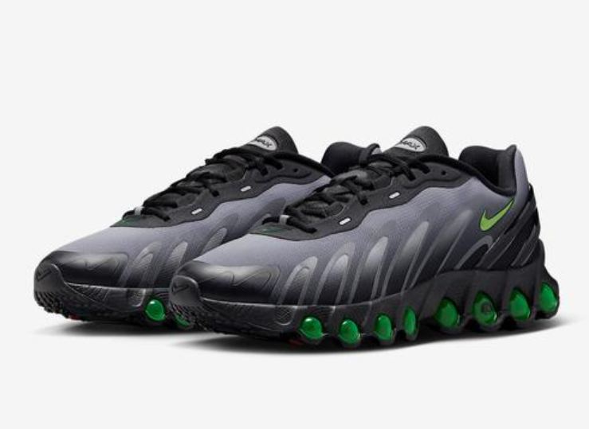
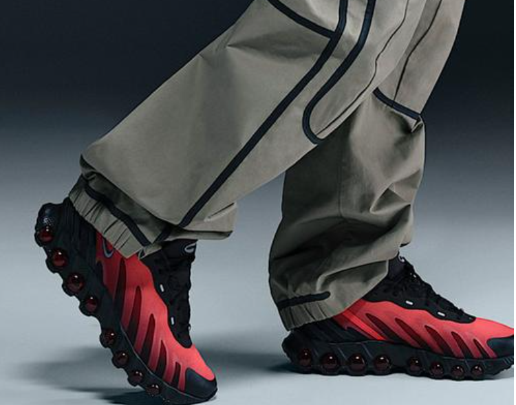

# Nike Air Max Dn8: The Hottest Sneaker of 2025

# Nike Air Max Dn8: The Hottest Sneaker of 2025 🔥

Hey sneakerheads! 👋 If you're as obsessed with fresh kicks as I am, then you've gotta hear about the Nike Air Max Dn8. This 2025 release from Nike's iconic Air Max family has been making waves in the sneaker scene, and for all the right reasons. Let's dive deep into what makes this shoe a must - have!

## 🌟Star - Studded Endorsements

One of the first things that caught everyone's attention about the Air Max Dn8 is the long list of celebrities and athletes who've been spotted wearing it. Nike athletes like Victor Wembanyama, Midge Purce, and CeeDee Lamb have all been seen rocking these sneakers. But it's not just sports stars; the fashion and music worlds have also jumped on the bandwagon. British rapper Central Cee, Nigerian fashion entrepreneur Iretidayo Zaccheaus, and artist Chy Cartier have all been photographed in the Air Max Dn8, showing off different styles and ways to wear them.

When you see these trendsetters wearing a pair of shoes, it's hard not to get excited. It makes you wonder what it is about the Air Max Dn8 that has everyone from the basketball court to the music stage reaching for them. And let's be real, if it's good enough for them, it's probably good enough for us to at least give it a try, right? \[Here, insert a collage of the mentioned stars wearing the Air Max Dn8]

## 🛠️Innovative Design and Technology

### The Mid - sole Magic&#xA;

For those who are already fans of the Air Max series, the technology in the Air Max Dn8's mid - sole might sound familiar at first. Just like its predecessor, the Air Max Dn, it features Dynamic Air technology. But here's the game - changer: this is the first time Nike has extended this technology to cover the entire foot. What does that mean for you? A more uniform and responsive cushioning experience. Whether you're running, jumping, or just walking around the city, your feet will feel like they're floating on air.

The mid - sole's design is also a visual treat. With its large, visible air units, it's clear that this shoe is all about comfort and performance. And the way the air units are integrated into the sole gives the shoe a unique, futuristic look that sets it apart from other sneakers on the market. \[Show a close - up image of the mid - sole with the visible air units]

### Upper - Level Comfort and Style&#xA;

The 鞋面 of the Air Max Dn8 is made from a lightweight fabric material. This not only makes the shoe breathable, which is a huge plus, especially during those hot summer days, but it also conforms to the shape of your foot for a snug fit. To add some extra style and durability, Nike has used a heat - press process on the upper. This gives the shoe a textured, multi - dimensional look that's both stylish and practical.

There's also a plastic heel clip that provides additional support for your ankle. It's a small detail, but it makes a big difference when you're on the move. Whether you're making quick cuts on the basketball court or just going about your daily activities, the heel clip helps keep your foot in place and reduces the risk of injuries. \[Insert an image of the shoe's upper to show the fabric texture and the heel clip]

## 👟A Style for Every Occasion

One of the best things about the Air Max Dn8 is its versatility. You can dress it up or down, depending on the occasion. For a casual day out, pair it with some ripped jeans, a graphic tee, and a denim jacket. It's the perfect look for running errands, meeting friends at a coffee shop, or just strolling around the mall.

If you're going for a more sporty look, wear it with your favorite workout gear. Whether you're hitting the gym, going for a jog, or playing a pickup game of basketball, the Air Max Dn8 will not only keep you comfortable but also make you look like a pro. And for those who like to make a statement, the bold colors and unique design of the shoe make it easy to stand out from the crowd. \[Include pictures of different outfit combinations with the Air Max Dn8]

## 🎉The Hype and the Community

The release of the Air Max Dn8 has created a huge buzz in the sneaker community. Sneakerheads around the world have been eagerly waiting to get their hands on a pair. There have been long lines outside Nike stores on release day, and the shoes have been selling out quickly both in - store and online.

Part of the hype is due to the brand's reputation for innovation and quality. Nike has been a leader in the sneaker industry for decades, and every new release is seen as an opportunity for the brand to push the boundaries of what a sneaker can be. The Air Max Dn8 is no exception. It combines the latest technology with stylish design, making it a highly sought - after item.

Another reason for the hype is the sense of community that comes with being a sneakerhead. When a new and exciting shoe like the Air Max Dn8 is released, it becomes a topic of conversation among enthusiasts. People share their thoughts, opinions, and unboxing experiences on social media platforms like Instagram, YouTube, and TikTok. It's a way for sneaker lovers to connect with each other, share their passion, and stay up - to - date on the latest trends. \[Insert some screenshots of social media posts about the Air Max Dn8]

## 💰Price and Availability

The Air Max Dn8 is available at a range of price points, depending on the version and any special collaborations. The standard models are priced competitively for a high - end sneaker, making them accessible to a wide range of consumers. However, if you're eyeing a limited - edition or premium version, be prepared to shell out a bit more. But let's be honest, for true sneaker collectors, the price is often worth it for a pair of shoes that are both stylish and innovative.

As for availability, the shoes were released earlier this year. While they might have sold out quickly in some stores, you can still find them on the Nike official website, as well as at select sneaker retailers. Keep an eye out for restocks, and if you really want a pair, it might be worth signing up for notifications on the Nike app or website so you don't miss out.

👣How They Compare to Other Nike Sneakers

### Against the Air Max Dn&#xA;

Compared to its predecessor, the Air Max Dn, the Air Max Dn8 has some significant improvements. The most obvious one is the extension of the Dynamic Air technology to the entire foot. This results in a more balanced and comfortable ride. The Air Max Dn8 also has a more streamlined and aerodynamic look. The designers have paid more attention to the details of the upper, making it look more modern and stylish. While the Air Max Dn was a great shoe, the Air Max Dn8 takes things to the next level. \[Show a side - by - side comparison image of the Air Max Dn and Air Max Dn8]

### In the Nike Sneaker Lineup&#xA;

When we look at the broader Nike sneaker lineup, the Air Max Dn8 holds its own. It's not just another running or basketball shoe. It's a lifestyle sneaker that can be worn in various situations. Compared to classic Nike models like the Air Jordan series, which are more focused on basketball heritage and style, the Air Max Dn8 offers a more modern and tech - forward approach. And compared to Nike's lightweight running shoes, it provides more support and a unique aesthetic that goes beyond just functionality.

## 💬What the Critics and Fans Are Saying

The reviews for the Air Max Dn8 have been mostly positive. Critics have praised its innovative technology, comfortable fit, and stylish design. Many have noted that the shoe lives up to Nike's reputation for quality and performance. Fans, on the other hand, have been raving about how comfortable the shoes are to wear all day long. They love the fact that they can be dressed up or down, and they appreciate the unique look that sets the Air Max Dn8 apart from other sneakers in their collection.

Of course, no product is perfect, and there have been a few minor complaints. Some users have said that the fabric upper might not be as durable as they would like, especially if they're rough on their shoes. And a small number of people have found that the sizing runs a bit small, so it's a good idea to try them on in - store if possible or check the sizing guide carefully before ordering online. \[Insert some quotes from critics and fans]

## 🌟Final Thoughts

In conclusion, the Nike Air Max Dn8 is a sneaker that lives up to the hype. With its star - studded endorsements, innovative technology, stylish design, and versatility, it's no wonder that it's become a favorite among sneakerheads and fashion enthusiasts alike. Whether you're a die - hard Nike fan or just looking for a new pair of kicks to add to your collection, the Air Max Dn8 is definitely worth considering.

So, what are you waiting for? Head over to your nearest Nike store or check out the website and see if the Air Max Dn8 is the right fit for you. Trust me, once you put them on, you might not want to take them off! 👟

