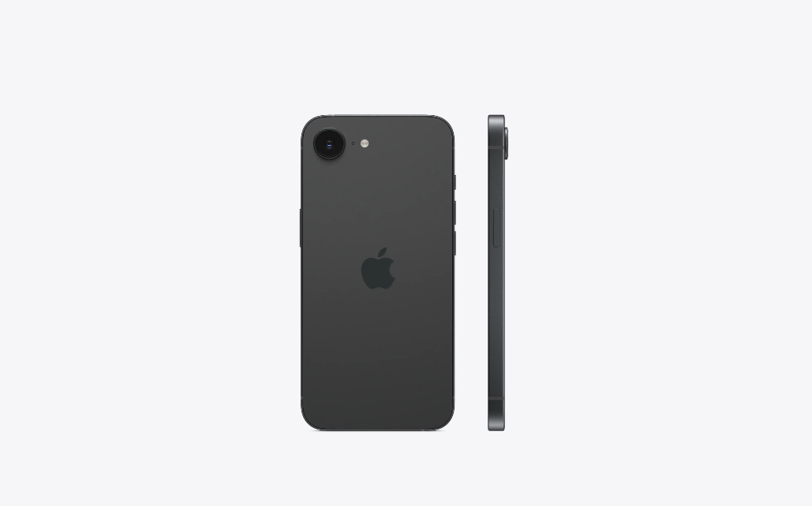
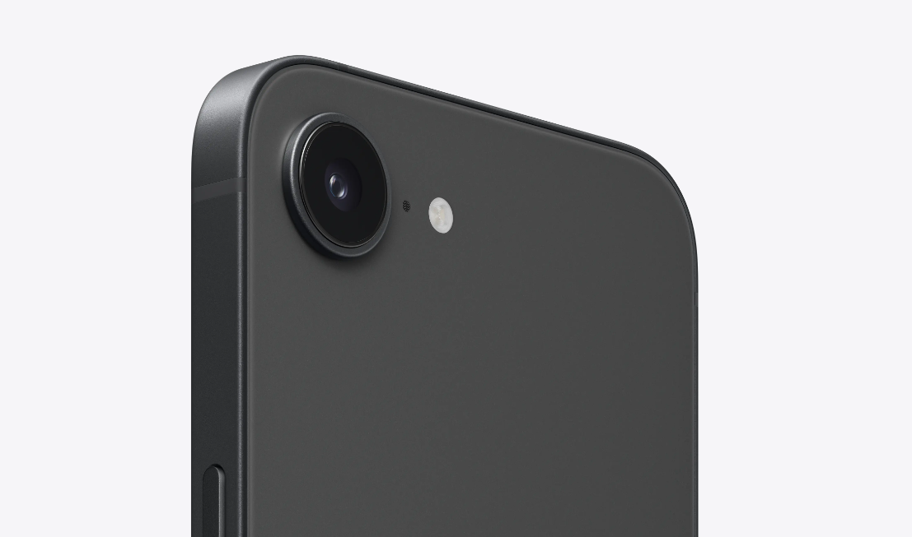

# Review of Apple iPhone 16e: Is It a Cost - effective Choice or a Compromised One?

# Review of Apple iPhone 16e: Is It a Cost - effective Choice or a Compromised One?

## I. Introduction
In the highly competitive smartphone market, Apple has always held a significant position with its unique design, excellent performance, and powerful ecosystem. On May 26, 2025, Apple officially launched the new iPhone 16e. This phone is positioned as a relatively affordable option, which has caught the attention of many consumers. Today, let's take an in - depth review of the iPhone 16e and see if it's worth buying.

<!--more-->

## II. Design: Simple, Light, and a Classic Continuation

### (1) Overall Shape
The iPhone 16e features the classic straight - edged frame design, quite similar to the iPhone 14 series. With a body size of 71.5x7.8x146.7mm and a weight of only 167 grams, it's super light and easy to carry. You won't feel tired even if you hold it for a long time. This light and thin design is a big plus for those who like one - handed operation or value portability.

### (2) Screen Design
It comes with a 6.1 - inch Super Retina XDR display with a resolution of 2532×1170. Using OLED technology, it supports HDR display, True Tone display, and P3 wide color gamut. The screen shows sharp and vivid colors, offering a great visual experience when watching videos or playing games. However, it uses the notch screen design. Compared with the Dynamic Island pill - shaped screen of the iPhone 16, it seems a bit less techy, and the notch part takes up some screen space.

### (3) Color and Material
The iPhone 16e offers two classic color options: black and white, catering to different users' aesthetic needs. The body uses an aerospace - grade aluminum middle frame, paired with a ceramic shield front and a glass back. It not only looks simple and stylish but also has good wear - resistance and drop - resistance. The use of the ceramic shield front makes the phone four times more resistant to drops, which is a blessing for clumsy users.

### (4) Buttons and Ports
In terms of buttons, the iPhone 16e has ditched the traditional mute switch and added an action button. Users can customize quick functions according to their needs, like quickly opening the camera, flashlight, or payment code. It's so convenient! As for the ports, it has changed from the Lightning port to the USB - C port, which is in line with the market trend and makes it easier to transfer data and charge with other devices.

## III. Performance: Powerful Chip, Smooth Experience

### (1) Chip and Memory
The iPhone 16e is powered by the A18 Bionic chip, which has a new - generation 6 - core CPU (2 performance cores and 4 efficiency cores), a new - generation 4 - core GPU, and a new - generation 16 - core Neural Engine. Although its GPU has one less core than the standard iPhone 16, the 6 - core CPU still packs a punch. Paired with at least 8GB of RAM, it can handle multiple tasks smoothly. Whether you're opening a bunch of office apps, social apps, or playing big - name games, it won't lag easily.

### (2) System and Software
It comes pre - installed with the iOS 18 operating system. The system interface is simple and beautiful, and it runs smoothly and stably. Moreover, it supports Apple Intelligence technology, and more smart scenarios can be expanded through system updates in the future. For example, the Chinese version of Apple Intelligence will be launched in April. With the help of AI, the voice assistant Siri becomes even smarter, and the notification summary function helps users manage information more efficiently. There's also a chance to access ChatGPT and generative AI functions in the future, making it more fun and useful.

### (3) Gaming Experience
When it comes to gaming, the iPhone 16e can handle most mainstream games with ease. Popular games like Honor of Kings and Peacekeeper Elite can run smoothly at high - quality settings, with stable frame rates. However, since its GPU only has 4 cores, when running some graphically - intensive 3D games like Genshin Impact, there may be some frame rate fluctuations, and it won't be as smooth as the iPhone 16.

## IV. Photography: Single - Camera Setup, Decent but Not Outstanding

### (1) Rear Camera
The iPhone 16e has a 48 - megapixel dual - purpose rear camera system. It supports 2x optical zoom and up to 10x digital zoom, and it also has optical image stabilization. In well - lit environments, it can take clear and colorful photos with good detail. The 2x optical zoom is usually enough for daily shooting, like taking pictures of distant scenery or close - up portraits.

However, its photography capabilities also have some drawbacks. It only has a single rear camera, without an ultra - wide - angle or telephoto lens. When shooting large - scale landscapes or group photos, it can't capture the whole scene, and the field of view is limited. Also, it lacks features like sensor - shift optical stabilization, Cinematic mode, and macro photography. It doesn't support the camera control button, so it's not as practical as the iPhone 16 series. In Portrait mode, it can only recognize people, and it won't work when shooting pets or still objects.

### (2) Front Camera
The front - facing camera is 12 megapixels with an f/1.9 aperture and supports autofocus and a Retina Flash. For selfies, it can meet daily needs. The photos it takes have accurate color reproduction and natural skin tones. It also supports Portrait mode and various portrait lighting effects, allowing you to take artistic selfies.

### (3) Video Recording
Video recording is a highlight of the iPhone 16e. It supports 4K Dolby Vision video recording at up to 60fps, and it has video optical image stabilization and Cinematic video stabilization. The videos it shoots are stable, clear, and colorful, meeting the needs of users for high - quality video recording. Additionally, it supports audio zoom, spatial audio, and stereo recording, making the audio in the videos even better.

## V. Battery Life: Excellent, Say Goodbye to Battery Anxiety

### (1) Battery Capacity and Performance
The iPhone 16e is the first to use Apple's self - developed modem, Apple C1, which significantly improves energy efficiency. It has a relatively large - capacity battery, and the video playback time can reach up to 26 hours, which is quite impressive among Apple's 6.1 - inch models. Even heavy users can get through a whole day with a full charge in the morning. Some users have tested that with 5G always on, listening to music while walking, chatting on WeChat, taking random photos, and browsing feeds and videos, the battery still had 38% left from 11 am to 6 pm.

### (2) Charging Methods
It supports 20W wired fast charging and can charge up to 50% in 30 minutes. It also supports 7.5W wireless charging. However, it doesn't support MagSafe magnetic charging, which might be inconvenient for users who are used to magnetic accessories. And the 7.5W wireless charging power is relatively low, so it takes a long time to fully charge the phone.

## VI. Network and Connectivity: Meets Basic Needs, Room for Improvement

### (1) Cellular Network
The iPhone 16e is equipped with Apple's self - developed C1 communication chip, supporting multiple network bands such as 5G NR (bands n1, n2, n3, n5, n7, n8, n12, n20, n25, n26, n28, n30, n38, n40, n41, n48, n66, n70, n75, n76, n77, n78, n79) and FDD - LTE. In daily use, its signal performance can generally meet the needs, and it can maintain a stable network connection in most scenarios. However, compared with the Qualcomm X75 baseband used in the iPhone 16, it may be a bit behind in terms of network speed and band support, especially in areas with good 5G coverage, where you won't be able to enjoy the fastest network experience.

### (2) Wireless Network
It supports 802.11ax Wi - Fi 6 with 2x2 MIMO technology, as well as Bluetooth 5.3 and NFC functions. In terms of wireless network connectivity, it can meet users' daily needs for surfing the Internet, watching videos, and transferring files. But it's important to note that it doesn't support Wi - Fi 7 and UWB chips. In complex network environments with many users, its network speed and stability may not be as good as phones that support Wi - Fi 7. Also, its positioning and device interconnection functions are limited when compared with other Apple devices that support UWB.

## VII. Price and Cost - effectiveness: Affordable, but with Trade - offs

### (1) Price Range
The iPhone 16e comes in three storage options: 128GB, 256GB, and 512GB. The starting price in China is 4499 yuan for the 128GB version, 5499 yuan for the 256GB version, and 7499 yuan for the 512GB version. Compared with the iPhone 16 series, it's more affordable, which is attractive to users on a budget who want to experience the Apple ecosystem.

### (2) Cost - effectiveness Analysis
In terms of cost - effectiveness, the iPhone 16e has its pros and cons. It performs well in terms of performance and battery life. The A18 chip and the self - developed C1 modem provide strong performance and excellent battery life. It also supports dual - SIM and IP68 water - resistance, which are practical features. However, it has some weaknesses in camera functions, GPU performance, screen brightness, and wireless charging. Compared with Android phones in the same price range, its configuration may not be as competitive. So, for users who don't have high requirements for photography, gaming, etc., and value the daily use experience and the Apple ecosystem, the iPhone 16e is a viable option. But for those who pursue top - notch performance and comprehensive functions, they may need to think twice.

## VIII. Conclusion and Suggestions

### (1) Pros Summary
1. **Powerful Performance**: Powered by the A18 Bionic chip, the 6 - core CPU performs excellently. Paired with at least 8GB of RAM, it runs smoothly in daily use.
2. **Great Battery Life**: With Apple's self - developed modem Apple C1, energy efficiency is greatly improved. The video playback time can reach 26 hours, so you don't have to worry about running out of battery.
3. **Light and Portable**: Weighing only 167 grams with a straight - edged aluminum frame, it feels great in the hand and is easy to carry around.
4. **Practical Upgrades**: The added action button allows for customizing quick functions. It supports dual - SIM and IP68 water - resistance, meeting the daily needs of more users.
5. **AI - Powered**: Supports Apple Intelligence, and more smart scenarios can be expanded in the future. Siri is smarter, and the notification summary function is more efficient.

### (2) Cons Analysis
1. **Weaker GPU Performance**: The A18 chip's GPU has only 4 cores. When running graphically - intensive 3D games, it's not as smooth as the iPhone 16.
2. **Limited Camera Functions**: It only has a single 48 - megapixel rear camera, lacking an ultra - wide - angle lens, macro photography, and other core features.
3. **Poor Wireless Charging**: No MagSafe magnetic charging, and the 7.5W wireless charging power is low, taking a long time to fully charge.
4. **Low Screen Brightness**: The typical brightness is only 800 nits, so it may be hard to see the screen in bright sunlight.
5. **Weak Network Performance**: Only supports Wi - Fi 6, no Wi - Fi 7, and no UWB chip, so the positioning and device interconnection functions are limited.

### (3) Suggestions for Target Users
1. **Teenagers**: The relatively low price is more acceptable to parents, and with Apple's durability, it can last for 3 - 5 years.
2. **Android Users Who Want to Try Apple**: Especially those whose colleagues, family members, or other 3C devices are in the Apple ecosystem can experience Apple's software and services.
3. **Users of SE Series or Older iPhones**: They can feel the convenience improvements in performance, battery life, and screen of the iPhone 16e.
4. **Users Who Use It as a Work Phone**: It can handle basic paperwork and simple photo - taking tasks, and the optimized battery life is enough for most work scenarios.

Overall, the iPhone 16e is a relatively affordable option. It performs well in terms of performance and battery life, but it has some shortcomings in camera functions and wireless charging. If you don't mind these drawbacks and want to experience the Apple ecosystem and the performance of the A18 chip at a lower price, then the iPhone 16e is a good choice. But if you're after top - notch performance and comprehensive functions, you may need to think again.
