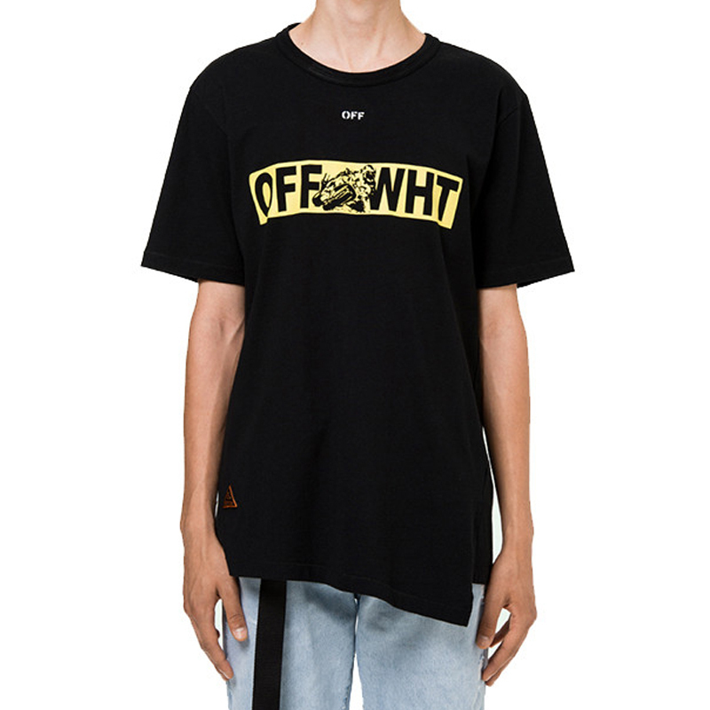
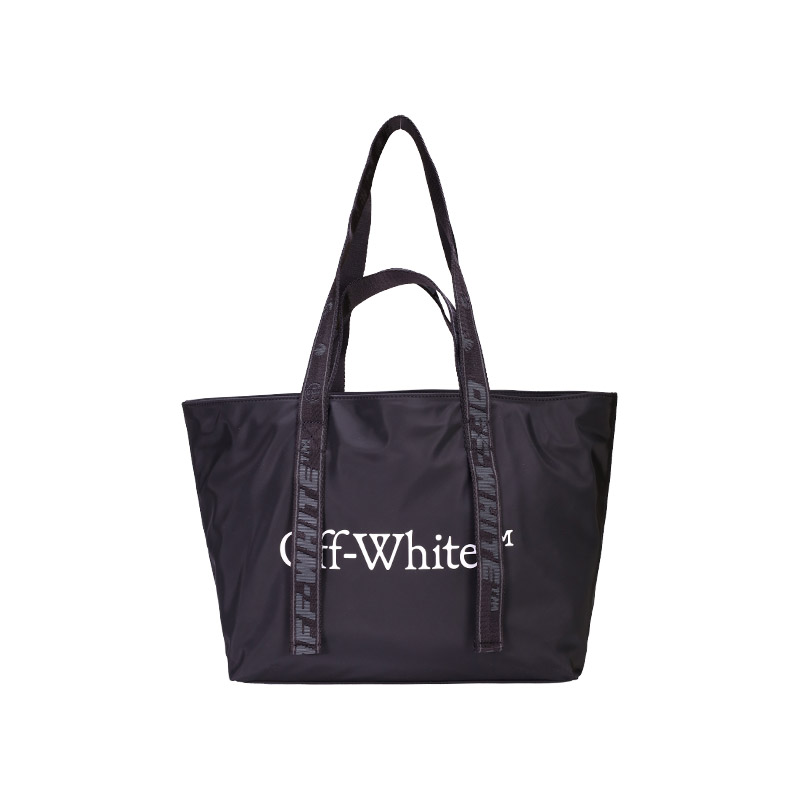

# Unmissable Deals: Off-White's May Promotions in the US!

# Unmissable Deals: Off-White's May Promotions in the US! 🛍️

Hey fashionistas and trendsetters! 🎉 May is here, and Off-White, the iconic brand that seamlessly blends streetwear with luxury, is rolling out some amazing promotions on its US website. If you've been eyeing those stylish pieces from Off-White, this is your golden opportunity to add some edge to your wardrobe without breaking the bank. Let's dive into the details of these irresistible offers!

## 1. Up to 75% Off on Spring/Summer 2025 Collection 🌞

Off-White is offering an incredible no - threshold 75% discount on its 2025 spring/summer new - style trendy clothing. This is a chance to grab some of the season's hottest pieces at a fraction of the original price. 

### Clothing Highlights
- **Green Printed Ribbed Top**: This top combines a unique print with a ribbed texture, adding a touch of elegance to your summer look. Originally priced at $325, it's now only $244! 

- **Bookish Shadow White Baseball Cap**: A classic accessory that can elevate any outfit. Whether you're going for a casual stroll or a sports event, this cap is a must - have. It was $335, and you can get it for just $251. 
- **Bookish Logo Band Hoodie**: With its cool logo and comfortable fit, this hoodie is perfect for those laid - back summer evenings. From $365 to $274, it's a steal! 

### Footwear and Bags
- **New Low Vulcanized Sneakers**: These sneakers are not only stylish but also comfortable for all - day wear. They were priced at $450, and now you can own them for $338. 

- **Black Fresco Print Outdoor Camera Bag**: A functional and fashionable bag for your outdoor adventures. It's been reduced from $995 to $746. 

## 2. Additional Discounts and Bonuses 🎁

### Nordstrom's Exclusive Offer
Nordstrom is having a special promotion on Off-White items. There's an additional 7.5% discount on爆款 items. And if your order reaches certain amounts, you'll get some great bonuses: 
- Order over $300, and you'll receive $50 Notes. 
- Spend over $500, and you'll get $100 Notes. 
- When your order exceeds $850, you'll be rewarded with $200 Notes. The offer is valid until June 8th, so hurry! Plus, enjoy free shipping within the US, and some areas even get 2 - day express delivery. 

### SSENSE's May Discount
During May 6th - 17th, SSENSE is offering an 85% discount on most items. You can use the discount code "SHOP15" at checkout, but this code is only available for customers in Canada and the US. 
- **Off - White's Simpson Series T - Shirts**: After the discount, you can get these cool T - shirts for 586.5 CAD. 
- **Boat Series T - Shirt**: Originally priced at a certain amount, it's now only 335.75 CAD after the discount. 

## 3. Why Off-White? 🤔

Off-White, founded by the visionary Virgil Abloh in 2012, has become a symbol of contemporary fashion. It's not just a brand; it's a statement. The brand's pieces are known for their unique designs, high - quality materials, and the ability to make you stand out in the crowd. Whether you're a fan of streetwear, luxury fashion, or a combination of both, Off-White has something for you. 

### Design Philosophy
Off-White's designs are deeply rooted in current culture. They often feature bold graphics, unique prints, and unexpected details. For example, the use of arrows, quotation marks, and other iconic symbols in their designs has become a signature of the brand. These elements not only add a sense of style but also tell a story about the brand's attitude towards fashion. 

### Quality Assurance
The brand takes pride in its manufacturing process, which is based in Milan. They have high standards when it comes to fabric selection, fit, and production. This ensures that every piece you purchase from Off-White is not only stylish but also durable. 

## 4. How to Shop? 🛒

### Step 1: Visit the Off - White US Website
Head over to [Off - White US Website](https://www.off---white.com/en-us/). Browse through the different categories, including men's, women's, and kids' clothing, as well as shoes and bags. 

### Step 2: Select Your Items
Once you've found the pieces you love, add them to your cart. Pay attention to the sizes and colors available. You can also check the product descriptions for more details about the materials and care instructions. 

### Step 3: Apply Discount Codes
If you're shopping on SSENSE or taking advantage of other promotions, don't forget to enter the relevant discount codes at checkout. This will ensure that you get the maximum savings. 

### Step 4: Complete Your Purchase
Review your order to make sure everything is correct. Then, proceed to the payment page. Off-White's US website supports domestic credit cards, making the payment process easy and convenient. 

## 5. Styling Tips 🎈

### For Men
- Pair a Bookish Logo Band Hoodie with a pair of black skinny jeans and white sneakers for a classic streetwear look. Add a black leather jacket for an extra layer of style. 
- The Green Printed Ribbed Top can be worn under a lightweight blazer for a more sophisticated outfit. Combine it with khaki chinos and brown loafers. 

### For Women
- The White Spray Arrow Bowling Shirt can be tucked into a high - waisted denim skirt and paired with heeled sandals for a feminine and trendy look. 
- Layer a Roses Mesh Short Dress over a white long - sleeve top and add black ankle boots for a cool and edgy outfit. 

## 6. Customer Reviews and Testimonials 🌟

Don't just take our word for it! Here are some reviews from customers who have already purchased Off-White items during the promotions: 
- "I've been waiting for a chance to buy an Off-White piece, and this May promotion was perfect. I got a great deal on a hoodie, and the quality is amazing." - John, 28 
- "The 75% discount on the spring/summer collection is insane. I was able to get a few tops and a pair of sneakers at a very reasonable price. Can't wait to wear them!" - Sarah, 24 

## 7. Conclusion

May is the month to indulge in some fashion shopping at Off-White's US website. With these amazing promotions, you can update your wardrobe with the latest trends from one of the most influential brands in the fashion world. Whether you're a long - time fan of Off-White or a newcomer, there's something for everyone. So, what are you waiting for? Head to the website now and start shopping! 🚀

Remember, these promotions won't last forever, so make the most of this opportunity and grab your favorite Off-White pieces before they're all gone! 🔥

